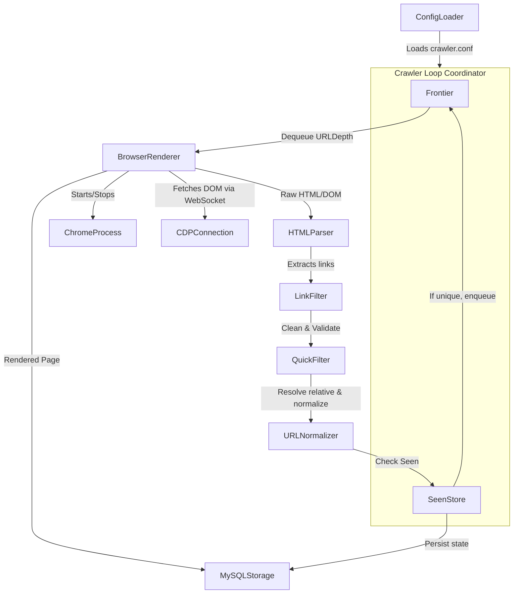

# Web Crawler Coordinator (Version 4)

A C++ Web Crawler designed to search, render, filter, and extract document links dynamically. Using Chrome DevTools Protocol (CDP) for javascript rendering, Windows Job Objects to manage child processes, and a custom system to parse, normalize, and persist URLs directly in MySQL.

---

## Architecture Overview

The crawl loop utilizes a single-threaded coordinator, coordinate-scheduling frontier queues, seen-store indexes, link parsers, filters, and persistence nodes:



---

## Core Components

1. **Frontier & SeenStore**: Acts as the BFS prioritization coordinator.
   - **Frontier**: Implements a custom FIFO Queue around `SinglyList` for BFS crawl routing.
   - **SeenStore**: Uses a custom FNV-1a `HashMap` lookup table (`DISCOVERED`, `CRAWLED`, `FAILED`) to guarantee strict cycle avoidance and skip duplicates.
2. **Browser Renderer (`CDPConnection` & `ChromeProcess`)**:
   - Launches headless Google Chrome using the `--headless=new` and `--window-position=-2400,-2400` arguments to prevent visual frame leakage on Windows.
   - Registers Chrome process inside a Windows Job Object (`JOB_OBJECT_LIMIT_KILL_ON_JOB_CLOSE`) to automatically terminate child Google Chrome instances when the crawler exits.
   - Connects to Chrome over a WebSocket connection to send Chromium commands (Page navigate, evaluated HTML extraction).
3. **HTML Parser & Pattern Matcher**:
   - **HTMLParser**: Evaluates DOM data to extract links and tag values.
   - **PatternMatcher**: Implements a fast Knuth-Morris-Pratt (KMP) string matching algorithm. Supports default **Case-Insensitive** matches (e.g. for parsing HTML `href` or `HREF` attributes) and **Case-Sensitive** variants (`findcs`, `findallcs`, `containscs`).
4. **URL Filter & Normalization Pipeline**:
   - **QuickFilter**: Safes and trims white spaces and blocks unwanted schemes (e.g. `mailto:`, `javascript:`, `tel:`).
   - **LinkFilter**: Evaluates URL hosts and formats against list lookups (loaded from `config/blockeddomains.txt` and `config/blockedextensions.txt`).
   - **URLParser** & **URLNormalizer**: Standardizes credentials, schemes, and domain cases, resolves relative paths, and cleans anchors/fragments.
5. **MySQL Storage Layer**:
   - Holds page HTMLs and discovery lists. Integrates parameterized statement binding to prevent SQL injection and maximize writing speeds.
6. **Config Loader**:
   - Externalizes environment options to `config/crawler.conf` and exposes typed getters.

---

## Configuration (`config/crawler.conf`)

Adjust the settings inside `config/crawler.conf` to direct crawl tasks:

```ini
# Database credentials
db_host = 127.0.0.1
db_user = root
db_pass = root_password
db_name = crawler_db
db_port = 3306

# Crawl scope parameters
max_depth = 3
max_pages = 100

# Resume Mode configuration
# Options:
#  - resume: Reloads frontier queue and state from the database and continues
#  - clear : Wipes database tables and starts a fresh crawl
#  - keep  : Preserves database records but initiates fresh frontier crawling
resume_mode = resume
```

---

## Setup & Compilation

### Prerequisites
- **Compiler**: C++17 compatible compiler (e.g., MinGW-w64 on Windows).
- **Build System**: CMake (version 3.15 or newer).
- **Libraries**: MySQL Connector C++ / libmariadb.
- **Dependencies**: `nlohmann_json` (managed via CMake FetchContent).

### Compilation Pipeline

Run the following commands in custom shell environments:

```powershell
# Generate build configuration
cmake -B build -S . -G "MinGW Makefiles"

# Build all binaries
cmake --build build
```

This generates the following test target executables in `./build/`:
- `KMPTests.exe` (PatternMatcher testing)
- `QUICKFILTERTests.exe` (QuickFilter/LinkFilter checks)
- `RENDERTests.exe` (CDP and headless browser integration)
- `CRAWLER.exe` (The main crawler executable)

---

## Verification and Testing

Verify code corrections and execution integrity using `ctest`:

```powershell
ctest --test-dir build --output-on-failure
```
